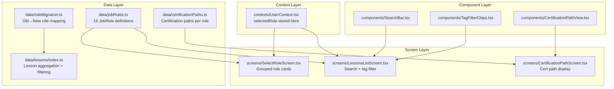

# Design Document: Learn By Job Role

## Overview

This feature expands the Nimbus AWS learning app from 10 generic roles to 16 specific AWS job roles organized into 8 category tags. It introduces certification paths per role, updates the role selection screen to group roles by category, and adds search + tag-based filtering to the Courses screen. The design preserves backward compatibility with existing user role selections.

### Key Design Decisions

1. **Static data approach**: Job roles, categories, and certification paths are defined as static TypeScript data files (no backend changes needed). This matches the existing pattern used for lessons.
2. **Role ID migration map**: A lookup table maps old 10 role IDs to new 16 role IDs, so existing `user.selectedRole` values resolve correctly.
3. **Filtering is client-side**: All search and tag filtering happens in-memory since the lesson dataset is small (~550 lessons).
4. **Single category tag per role**: Each role belongs to exactly one category, simplifying the data model and UI grouping.

## Architecture



### Data Flow

1. **Onboarding**: User selects a role on `SelectRoleScreen` → role ID stored in `UserContext` via `setLearningPath("role", roleId)`.
2. **Courses Screen**: `LessonsListScreen` reads `user.selectedRole`, fetches lessons via `getLessonsByRole()`, then applies local search text and tag filters.
3. **Certification Path**: Accessible from the role selection screen or a dedicated screen/modal. Reads from `certificationPaths` data keyed by role ID.
4. **Backward Compatibility**: When `getLessonsByRole()` receives an old role ID, it checks `roleMigrationMap` first and expands to the matching new role IDs.

## Components and Interfaces

### New Data Files

#### `data/jobRoles.ts`

Exports the 16 job roles and the 8 category tags.

```typescript
export type CategoryTag =
  | "Architecture"
  | "Data Analytics"
  | "Development"
  | "Operations"
  | "DevOps"
  | "Security"
  | "Networking"
  | "AI/ML";

export interface JobRole {
  id: string;
  displayName: string;
  description: string;
  responsibilities: string[];
  icon: string; // emoji
  category: CategoryTag;
}

export const CATEGORY_TAGS: CategoryTag[] = [
  "Architecture",
  "Data Analytics",
  "Development",
  "Operations",
  "DevOps",
  "Security",
  "Networking",
  "AI/ML",
];

export const JOB_ROLES: JobRole[] = [
  // Architecture
  { id: "solutions_architect", displayName: "Solutions Architect", description: "Design and deploy scalable systems on AWS", responsibilities: ["Design distributed systems", "Select appropriate AWS services", "Optimize for cost and performance"], icon: "🏗️", category: "Architecture" },
  { id: "application_architect", displayName: "Application Architect", description: "Design application-level architectures on AWS", responsibilities: ["Define application patterns", "Integrate microservices", "Ensure high availability"], icon: "📐", category: "Architecture" },
  // Data Analytics
  { id: "cloud_data_engineer", displayName: "Cloud Data Engineer", description: "Build data pipelines and analytics solutions", responsibilities: ["Design ETL pipelines", "Manage data lakes", "Optimize query performance"], icon: "📊", category: "Data Analytics" },
  // Development
  { id: "software_development_engineer", displayName: "Software Development Engineer", description: "Build and maintain applications on AWS", responsibilities: ["Develop cloud-native apps", "Implement CI/CD", "Write infrastructure as code"], icon: "💻", category: "Development" },
  // Operations
  { id: "cloud_administrator", displayName: "Cloud Administrator", description: "Manage and operate systems on AWS", responsibilities: ["Provision resources", "Monitor system health", "Manage access controls"], icon: "🔧", category: "Operations" },
  { id: "cloud_engineer", displayName: "Cloud Engineer", description: "Build and maintain cloud infrastructure", responsibilities: ["Automate infrastructure", "Manage deployments", "Troubleshoot issues"], icon: "⚙️", category: "Operations" },
  // DevOps
  { id: "test_engineer", displayName: "Test Engineer", description: "Design and automate testing for cloud applications", responsibilities: ["Build test frameworks", "Automate regression tests", "Performance testing"], icon: "🧪", category: "DevOps" },
  { id: "cloud_devops_engineer", displayName: "Cloud DevOps Engineer", description: "Automate and optimize AWS infrastructure pipelines", responsibilities: ["Build CI/CD pipelines", "Infrastructure as code", "Monitor deployments"], icon: "🔄", category: "DevOps" },
  { id: "devsecops_engineer", displayName: "DevSecOps Engineer", description: "Integrate security into DevOps workflows", responsibilities: ["Security automation", "Compliance as code", "Vulnerability scanning"], icon: "🛡️", category: "DevOps" },
  // Security
  { id: "cloud_security_engineer", displayName: "Cloud Security Engineer", description: "Secure AWS infrastructure and applications", responsibilities: ["Implement security controls", "Incident response", "Encryption management"], icon: "🔒", category: "Security" },
  { id: "cloud_security_architect", displayName: "Cloud Security Architect", description: "Design security architectures for cloud environments", responsibilities: ["Security architecture design", "Threat modeling", "Compliance frameworks"], icon: "🏰", category: "Security" },
  // Networking
  { id: "network_engineer", displayName: "Network Engineer", description: "Design and manage AWS network infrastructure", responsibilities: ["VPC design", "Hybrid connectivity", "Network troubleshooting"], icon: "🌐", category: "Networking" },
  // AI/ML
  { id: "prompt_engineer", displayName: "Prompt Engineer", description: "Design and optimize prompts for AI/ML models", responsibilities: ["Prompt design", "Model evaluation", "Output optimization"], icon: "✍️", category: "AI/ML" },
  { id: "ml_engineer", displayName: "Machine Learning Engineer", description: "Build and deploy ML models on AWS", responsibilities: ["Model training", "ML pipelines", "Model deployment"], icon: "🤖", category: "AI/ML" },
  { id: "ml_ops_engineer", displayName: "Machine Learning Ops Engineer", description: "Operationalize ML models at scale", responsibilities: ["ML pipeline automation", "Model monitoring", "Infrastructure for ML"], icon: "🔬", category: "AI/ML" },
  { id: "data_scientist", displayName: "Data Scientist", description: "Analyze data and build predictive models", responsibilities: ["Statistical analysis", "Feature engineering", "Model experimentation"], icon: "📈", category: "AI/ML" },
];

// Helper to get roles grouped by category
export const getRolesByCategory = (): Record<CategoryTag, JobRole[]> => {
  const grouped = {} as Record<CategoryTag, JobRole[]>;
  for (const tag of CATEGORY_TAGS) {
    grouped[tag] = JOB_ROLES.filter((r) => r.category === tag);
  }
  return grouped;
};

// Helper to find a role by ID
export const getJobRoleById = (id: string): JobRole | undefined => {
  return JOB_ROLES.find((r) => r.id === id);
};
```

#### `data/certificationPaths.ts`

```typescript
export type CertificationLevel = "Foundational" | "Associate" | "Professional" | "Specialty";

export interface Certification {
  name: string;
  level: CertificationLevel;
  required: boolean;
}

export interface CertificationPath {
  roleId: string;
  certifications: Certification[];
}

export const CERTIFICATION_PATHS: Record<string, CertificationPath> = {
  solutions_architect: {
    roleId: "solutions_architect",
    certifications: [
      { name: "AWS Cloud Practitioner", level: "Foundational", required: true },
      { name: "AI Practitioner", level: "Foundational", required: true },
      { name: "Solutions Architect Associate", level: "Associate", required: true },
      { name: "Solutions Architect Professional", level: "Professional", required: true },
      { name: "Security Specialty", level: "Specialty", required: false },
    ],
  },
  // ... remaining 15 roles follow the same pattern
};

export const getCertificationPath = (roleId: string): CertificationPath | undefined => {
  return CERTIFICATION_PATHS[roleId];
};
```

#### `data/roleMigration.ts`

Maps old 10 role IDs to new role IDs for backward compatibility.

```typescript
// Maps each old role ID to one or more new role IDs
export const ROLE_MIGRATION_MAP: Record<string, string[]> = {
  cloud_practitioner: ["cloud_administrator"],
  solutions_architect: ["solutions_architect"],
  developer: ["software_development_engineer"],
  devops_engineer: ["cloud_devops_engineer"],
  sysops_administrator: ["cloud_administrator"],
  security_specialist: ["cloud_security_engineer"],
  database_specialist: ["cloud_data_engineer"],
  data_engineer: ["cloud_data_engineer"],
  ml_engineer: ["ml_engineer"],
  network_specialist: ["network_engineer"],
};

export const migrateRoleId = (oldRoleId: string): string[] => {
  return ROLE_MIGRATION_MAP[oldRoleId] ?? [oldRoleId];
};
```

### Updated Files

#### `data/lessons/index.ts` — Updated `getLessonsByRole()`

```typescript
import { migrateRoleId } from "../roleMigration";
import { JOB_ROLES, CategoryTag } from "../jobRoles";

// Updated to handle old role IDs via migration map
export const getLessonsByRole = (role: string): Lesson[] => {
  const resolvedRoles = migrateRoleId(role);
  return lessons.filter((lesson) =>
    lesson.roles.some((r) => resolvedRoles.includes(r))
  );
};

// New: filter lessons by category tag
export const getLessonsByCategory = (category: CategoryTag): Lesson[] => {
  const roleIds = JOB_ROLES.filter((r) => r.category === category).map((r) => r.id);
  return lessons.filter((lesson) =>
    lesson.roles.some((r) => roleIds.includes(r))
  );
};

// New: search lessons by title (case-insensitive)
export const searchLessons = (allLessons: Lesson[], query: string): Lesson[] => {
  const lower = query.toLowerCase();
  return allLessons.filter((l) => l.title.toLowerCase().includes(lower));
};
```

### New Components

#### `components/SearchBar.tsx`

A controlled text input with 300ms debounce. Props:

```typescript
interface SearchBarProps {
  value: string;
  onChangeText: (text: string) => void;
  placeholder?: string;
}
```

Uses `TextInput` with a search icon, styled to match the dark theme (`#1B263B` background, `#fff` text).

#### `components/TagFilterChips.tsx`

Horizontal `ScrollView` of category tag chips. Props:

```typescript
interface TagFilterChipsProps {
  tags: CategoryTag[];
  selectedTag: CategoryTag | null;
  onSelectTag: (tag: CategoryTag | null) => void;
}
```

Selected chip uses `Colors.accent` background; unselected uses `#1B263B`.

#### `components/CertificationPathView.tsx`

Vertical timeline-style list of certifications. Props:

```typescript
interface CertificationPathViewProps {
  certificationPath: CertificationPath;
}
```

Each certification shows a circle indicator (filled for required, outlined for optional), name, and level badge.

### Updated Screens

#### `screens/SelectRoleScreen.tsx`

- Replace flat `roles` array with `getRolesByCategory()`.
- Render `SectionList` grouped by `CategoryTag` headings.
- Each role card shows icon, display name, and description.
- Add a "View Certification Path" link/button on the selected role card.
- Continue button behavior unchanged.

#### `screens/LessonsListScreen.tsx`

- Add `SearchBar` component at top.
- Add `TagFilterChips` below search bar.
- Maintain local state: `searchQuery: string`, `selectedTag: CategoryTag | null`.
- Apply debounced search (300ms) and tag filter to lesson list.
- When both filters active, intersection of results is shown.

#### `screens/CertificationPathScreen.tsx` (New)

- Receives `roleId` as a route param.
- Looks up `getCertificationPath(roleId)`.
- Renders `CertificationPathView` or a "no path available" message.
- Registered in `RootStackParamList` and the root stack navigator.

### Navigation Changes

Add to `navigation/types.ts`:

```typescript
CertificationPath: { roleId: string };
```

Add screen to `navigation/index.tsx` stack.

## Data Models

### JobRole

| Field | Type | Description |
|-------|------|-------------|
| id | `string` | Unique identifier (snake_case) |
| displayName | `string` | Human-readable name |
| description | `string` | Short description |
| responsibilities | `string[]` | List of key responsibilities |
| icon | `string` | Emoji icon |
| category | `CategoryTag` | One of 8 category tags |

### CategoryTag (union type)

`"Architecture" | "Data Analytics" | "Development" | "Operations" | "DevOps" | "Security" | "Networking" | "AI/ML"`

### Certification

| Field | Type | Description |
|-------|------|-------------|
| name | `string` | Certification name |
| level | `CertificationLevel` | Foundational, Associate, Professional, or Specialty |
| required | `boolean` | Whether required or optional for the role |

### CertificationPath

| Field | Type | Description |
|-------|------|-------------|
| roleId | `string` | References `JobRole.id` |
| certifications | `Certification[]` | Ordered list from foundational to advanced |

### Role Migration Map

| Field | Type | Description |
|-------|------|-------------|
| key | `string` | Old role ID (one of the original 10) |
| value | `string[]` | Array of new role IDs it maps to |

### Updated Lesson (no schema change)

The `Lesson.roles` field (`string[]`) continues to hold role IDs. Existing lessons will have their role arrays updated to reference the new 16 role IDs. The `Lesson` type itself does not change.

### User Context (no schema change)

`User.selectedRole` remains a `string`. It stores the new role ID. For users who selected an old role ID, the migration map resolves it at query time — no data migration needed.


## Correctness Properties

*A property is a characteristic or behavior that should hold true across all valid executions of a system — essentially, a formal statement about what the system should do. Properties serve as the bridge between human-readable specifications and machine-verifiable correctness guarantees.*

### Property 1: Job role data integrity

*For any* job role in the `JOB_ROLES` array, it must have a non-empty `id` (unique across all roles), a non-empty `displayName`, a non-empty `description`, a non-empty `responsibilities` array, a non-empty `icon`, and a `category` that is one of the 8 valid `CategoryTag` values. The total count of job roles must be exactly 16.

**Validates: Requirements 1.1, 1.2**

### Property 2: Every job role has a certification path

*For any* job role ID in the `JOB_ROLES` array, there must exist a corresponding entry in `CERTIFICATION_PATHS` keyed by that role ID.

**Validates: Requirements 2.1**

### Property 3: Certification path data integrity and ordering

*For any* certification path, every certification in the path must have a non-empty `name`, a `level` from the set {Foundational, Associate, Professional, Specialty}, and a boolean `required` field. The certifications must be ordered by level such that no certification appears before a certification of a lower level (Foundational < Associate < Professional < Specialty).

**Validates: Requirements 2.2, 2.3, 2.4**

### Property 4: Single role selection

*For any* sequence of role selection actions on the `SelectRoleScreen`, exactly one role ID is stored in the user context at any time, and it matches the last selected role.

**Validates: Requirements 3.2, 3.3**

### Property 5: Search filter correctness

*For any* list of lessons and any non-empty search query string, the `searchLessons` function returns only lessons whose title contains the query string (case-insensitive), and every lesson in the original list whose title contains the query is included in the result.

**Validates: Requirements 5.2**

### Property 6: Combined search and tag filter is intersection

*For any* list of lessons, any search query, and any selected category tag, the combined filter result equals the intersection of: (a) lessons matching the search query by title, and (b) lessons associated with at least one role belonging to the selected category tag.

**Validates: Requirements 6.2, 6.4**

### Property 7: Tag filter toggle round-trip

*For any* list of lessons and any category tag, selecting the tag to filter and then deselecting it produces the same list as the original unfiltered list.

**Validates: Requirements 6.3**

### Property 8: Lesson role data integrity

*For any* lesson in the lessons array, its `roles` field must be a non-empty array and every role ID in the array must correspond to a valid job role ID in the `JOB_ROLES` array.

**Validates: Requirements 7.1, 7.3**

### Property 9: Role-based lesson lookup correctness with backward compatibility

*For any* role ID (whether an old 10-role ID or a new 16-role ID), `getLessonsByRole(roleId)` returns exactly the set of lessons that contain at least one of the resolved role IDs (after applying the migration map), and the result is non-empty for every old role ID.

**Validates: Requirements 7.2, 7.4**

## Error Handling

| Scenario | Handling |
|----------|----------|
| Unknown role ID passed to `getLessonsByRole()` | Migration map returns the ID as-is; filter returns empty array. No crash. |
| Unknown role ID passed to `getCertificationPath()` | Returns `undefined`. UI shows "no certification path available" message. |
| Empty search query | Returns full unfiltered lesson list (no-op filter). |
| No lessons match search + tag combo | Empty state UI with "No lessons found" message and icon. |
| User with old role ID in AsyncStorage | Migration map resolves it transparently at query time. No data migration needed. |
| `JOB_ROLES` or `CERTIFICATION_PATHS` data missing | App would fail to compile (static imports). Caught at build time. |

## Testing Strategy

### Unit Tests

Unit tests cover specific examples, edge cases, and integration points:

- **Data examples**: Verify the Solutions Architect certification path matches the exact spec (Req 2.5). Verify the specific role-to-category groupings match Req 1.3.
- **Edge cases**: Empty search query returns all lessons. Role with no certification path shows fallback message. Search with special characters doesn't crash.
- **Migration examples**: Each of the 10 old role IDs resolves to valid new role IDs. `cloud_practitioner` maps to `cloud_administrator`. `sysops_administrator` maps to `cloud_administrator`.
- **UI state**: Continue button disabled when no role selected (Req 3.5). Search bar cleared shows all lessons (Req 5.3).

### Property-Based Tests

Property-based tests verify universal properties across generated inputs. Use `fast-check` as the PBT library for TypeScript/React Native.

Each property test must:
- Run a minimum of 100 iterations
- Reference its design document property in a comment tag
- Use the format: `// Feature: learn-by-job-role, Property {N}: {title}`

**Property tests to implement:**

1. **Feature: learn-by-job-role, Property 1: Job role data integrity** — Generate no inputs (static data check), verify all 16 roles have required fields, unique IDs, and valid categories.

2. **Feature: learn-by-job-role, Property 2: Every job role has a certification path** — For each role in JOB_ROLES, verify CERTIFICATION_PATHS contains an entry.

3. **Feature: learn-by-job-role, Property 3: Certification path data integrity and ordering** — For each certification path, verify ordering and field validity.

4. **Feature: learn-by-job-role, Property 4: Single role selection** — Generate random sequences of role selections, verify only the last one is stored.

5. **Feature: learn-by-job-role, Property 5: Search filter correctness** — Generate random lesson arrays and random query strings, verify searchLessons returns exactly the matching subset.

6. **Feature: learn-by-job-role, Property 6: Combined search and tag filter is intersection** — Generate random lessons, queries, and tags, verify combined result equals intersection of individual filters.

7. **Feature: learn-by-job-role, Property 7: Tag filter toggle round-trip** — Generate random lesson arrays and tags, verify select-then-deselect produces original list.

8. **Feature: learn-by-job-role, Property 8: Lesson role data integrity** — For each lesson, verify non-empty roles array with all valid role IDs.

9. **Feature: learn-by-job-role, Property 9: Role-based lesson lookup correctness with backward compatibility** — Generate old role IDs, verify getLessonsByRole returns non-empty results with all resolved role IDs being valid.
