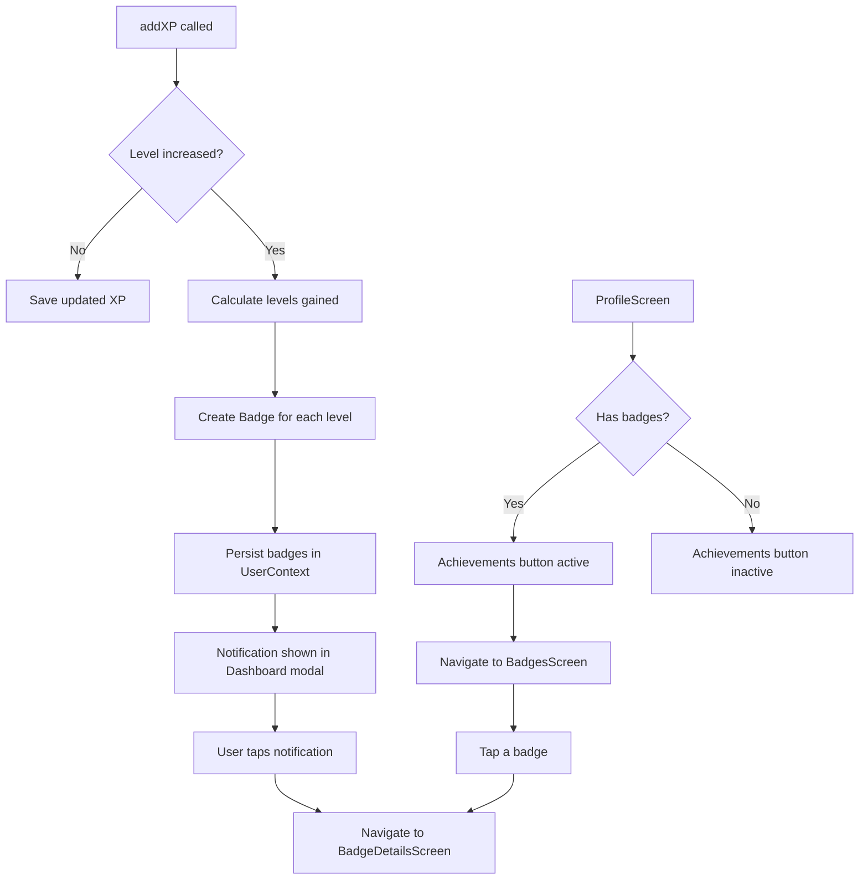

# Design Document: Level Badges

## Overview

The Level Badges feature adds a badge reward system to the Nimbus app. When a user accumulates enough XP to level up, the app automatically creates a `Badge` object recording the level name, timestamp, and XP at that moment. Two new screens — `BadgesScreen` (list) and `BadgeDetailsScreen` (single badge) — are added to the navigation stack. The existing Achievements button on `ProfileScreen` becomes active and navigates to `BadgesScreen`. A level-up notification appears in the `DashboardScreen` notification modal and deep-links to the new badge's details.

The feature integrates with the existing `UserContext` (state), `ThemeContext` (theming), and React Navigation stack. No new backend services or external dependencies are required — all data is persisted locally via `AsyncStorage` through the existing `UserContext` persistence mechanism.

## Architecture

The feature follows the app's existing architecture patterns:

- **State**: `UserContext` is extended with a structured `Badge` type (replacing the current `string[]` badges array) and a new `awardBadge` method. The `addXP` function is modified to detect level-ups and trigger badge creation.
- **Navigation**: Two new screens are registered in `RootStackParamList`. `BadgesScreen` takes no params. `BadgeDetailsScreen` takes a `badgeId` (the level number) to identify which badge to display.
- **Screens**: Both new screens consume `useUser()` and `useTheme()` hooks, following the same patterns as `ProfileScreen` and `DashboardScreen`.
- **Notifications**: The existing hardcoded notifications array in `DashboardScreen` is extended to include dynamically generated level-up badge notifications that deep-link to `BadgeDetailsScreen`.



## Components and Interfaces

### Modified Components

**UserContext (`contexts/UserContext.tsx`)**
- Replace `badges: string[]` with `badges: Badge[]` in the `User` type
- Add `awardBadge(level: number, xp: number): void` helper (internal)
- Modify `addXP` to detect level changes and call `awardBadge` for each level gained
- Handle multi-level jumps by iterating from `oldLevel + 1` to `newLevel`

**ProfileScreen (`screens/ProfileScreen.tsx`)**
- Convert the Achievements `<View>` to a `<TouchableOpacity>`
- Conditionally enable navigation: if `user.badges.length > 0`, navigate to `"Badges"`; otherwise, render as visually inactive
- Update badge count display to use `user.badges.length`

**DashboardScreen (`screens/DashboardScreen.tsx`)**
- Generate level-up notifications dynamically from `user.badges`
- Each badge notification includes an `onPress` handler that navigates to `BadgeDetailsScreen` with the badge's level as param
- Track read/unread state for badge notifications (store viewed badge levels in local state or `AsyncStorage`)

**Navigation (`navigation/types.ts` and `navigation/index.tsx`)**
- Add `Badges: undefined` and `BadgeDetails: { badgeLevel: number }` to `RootStackParamList`
- Register both screens in the Stack.Navigator

### New Components

**BadgesScreen (`screens/BadgesScreen.tsx`)**
- Displays a `FlatList` of all earned badges, sorted by `receivedAt` descending
- Each row shows badge name, date, and XP
- Tapping a row navigates to `BadgeDetailsScreen`
- Empty state when no badges exist
- Uses `useTheme()` colors throughout

**BadgeDetailsScreen (`screens/BadgeDetailsScreen.tsx`)**
- Receives `badgeLevel` via route params
- Looks up the matching badge from `user.badges`
- Displays: badge name ("Level N"), formatted date/time, XP earned
- Back button returns to previous screen
- Uses `useTheme()` colors throughout

## Data Models

### Badge Type

```typescript
type Badge = {
  level: number;        // The level number this badge represents (e.g. 1, 2, 3)
  name: string;         // Display name, e.g. "Level 1"
  receivedAt: string;   // ISO 8601 timestamp of when the badge was earned
  xpEarned: number;     // The user's total XP at the moment of leveling up
};
```

### Updated User Type

```typescript
type User = {
  // ... existing fields unchanged ...
  badges: Badge[];      // Changed from string[] to Badge[]
};
```

### Navigation Params

```typescript
// Added to RootStackParamList
Badges: undefined;
BadgeDetails: { badgeLevel: number };
```

### Badge Notification Shape (DashboardScreen local)

```typescript
type BadgeNotification = {
  id: string;           // e.g. "badge_level_3"
  title: string;        // "New Badge Earned!"
  message: string;      // "You earned a badge for completing Level 3"
  time: string;         // Relative time string
  read: boolean;        // Whether user has viewed this notification
  badgeLevel: number;   // For deep-link navigation
};
```


## Correctness Properties

*A property is a characteristic or behavior that should hold true across all valid executions of a system — essentially, a formal statement about what the system should do. Properties serve as the bridge between human-readable specifications and machine-verifiable correctness guarantees.*

### Property 1: Badge creation correctness

*For any* user and any XP addition that causes a level-up from level N-1 to level N, the resulting badge in the user's badges array should have `name` equal to `"Level N"`, a `receivedAt` field that is a valid ISO 8601 timestamp, and `xpEarned` equal to the user's total XP at the moment of leveling up.

**Validates: Requirements 1.1, 1.2, 1.3, 1.4**

### Property 2: Multi-level jump creates one badge per level gained

*For any* user at level L and any XP amount that causes the user to jump to level L+K (where K > 1), the number of new badges created should equal K, and each badge should correspond to exactly one of the levels L+1 through L+K.

**Validates: Requirements 1.5**

### Property 3: Badge list ordering

*For any* list of badges with distinct `receivedAt` timestamps, the badges displayed on the Badges screen should be sorted by `receivedAt` in descending order (most recent first).

**Validates: Requirements 2.1**

### Property 4: Achievements button activation state

*For any* user, the Achievements button on the Profile screen is active (navigable) if and only if the user's badges array is non-empty.

**Validates: Requirements 4.1, 4.3**

### Property 5: Level-up notification message format

*For any* level N that a user completes, the generated notification message should equal `"You earned a badge for completing Level N"`.

**Validates: Requirements 5.1**

## Error Handling

| Scenario | Handling |
|---|---|
| `addXP` called with negative or zero amount | Ignore the call, no state change |
| Badge lookup for non-existent level in `BadgeDetailsScreen` | Show a "Badge not found" message and provide back navigation |
| `user` is `null` when screens mount | Show loading/empty state (follows existing pattern in `ProfileScreen` and `DashboardScreen`) |
| `receivedAt` is an invalid date string | Display "Unknown date" fallback in `BadgeDetailsScreen` |
| Multi-level jump produces duplicate badge levels | Guard with a check: only create a badge if one doesn't already exist for that level |
| AsyncStorage write failure during badge persistence | Catch error, log it, and keep in-memory state consistent (follows existing `saveUser` pattern) |

## Testing Strategy

### Unit Tests

Unit tests cover specific examples, edge cases, and integration points:

- **Badge creation**: Verify that leveling from 1→2 creates a badge with name "Level 2"
- **Multi-level jump**: Verify that jumping from level 1→4 creates badges for levels 2, 3, and 4
- **Empty state**: Verify `BadgesScreen` renders empty state message when `badges` is `[]`
- **Badge details rendering**: Verify `BadgeDetailsScreen` displays name, date, and XP for a known badge
- **Achievements button inactive**: Verify the button does not navigate when `badges` is empty
- **Achievements button active**: Verify the button navigates to `Badges` when badges exist
- **Notification deep-link**: Verify tapping a badge notification navigates to `BadgeDetails` with correct `badgeLevel`
- **Notification unread state**: Verify new badge notifications start as unread
- **Badge not found**: Verify `BadgeDetailsScreen` handles a `badgeLevel` that doesn't exist in the badges array

### Property-Based Tests

Property-based tests use a PBT library (e.g., `fast-check`) to verify universal properties across randomized inputs. Each test runs a minimum of 100 iterations.

- **Property 1 test**: Generate random user states and XP amounts that trigger single level-ups. Assert the new badge has correct name format, valid ISO timestamp, and matching XP.
  - Tag: `Feature: level-badges, Property 1: Badge creation correctness`

- **Property 2 test**: Generate random user states and large XP amounts that trigger multi-level jumps. Assert the number of new badges equals levels gained and each level is represented exactly once.
  - Tag: `Feature: level-badges, Property 2: Multi-level jump creates one badge per level gained`

- **Property 3 test**: Generate random arrays of badges with random timestamps. Apply the sorting logic and assert the result is in descending `receivedAt` order.
  - Tag: `Feature: level-badges, Property 3: Badge list ordering`

- **Property 4 test**: Generate random badge arrays (including empty). Assert the button activation state equals `badges.length > 0`.
  - Tag: `Feature: level-badges, Property 4: Achievements button activation state`

- **Property 5 test**: Generate random level numbers. Assert the notification message equals the expected format string.
  - Tag: `Feature: level-badges, Property 5: Level-up notification message format`

### PBT Library

Use `fast-check` for TypeScript property-based testing. It integrates with Jest (the default test runner in Expo/React Native projects) and provides built-in arbitraries for numbers, strings, arrays, and dates.

Each correctness property maps to exactly one `fast-check` test. Each test is tagged with a comment referencing the design property number and text.
