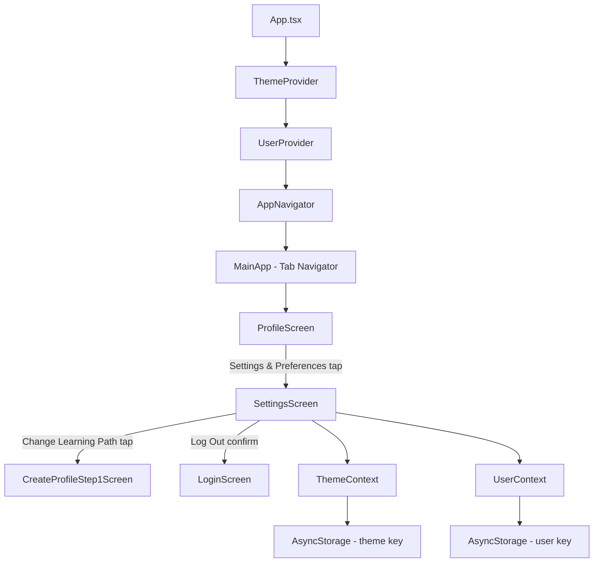

# Design Document: Settings & Preferences

## Overview

This feature adds a Settings & Preferences screen to the Nimbus AWS learning app, accessible from the existing Profile screen. It introduces a new `ThemeContext` for dark/light mode toggling with AsyncStorage persistence, and a `SettingsScreen` that consolidates account info, appearance, learning preferences, notifications, about info, and logout into a single scrollable view.

The design leverages the existing `UserContext` for notification preferences, daily goal, and learning path changes, and introduces a new `ThemeContext` to decouple theme state from user profile data. Navigation is extended by adding a `Settings` route to the `RootStackParamList`.

## Architecture

The feature follows the existing app architecture patterns:



The `ThemeProvider` wraps the entire app above `UserProvider` in `App.tsx` so all components can access theme colors. The `SettingsScreen` is registered as a stack screen in the root navigator, navigated to from `ProfileScreen`.

### Key Design Decisions

1. **Separate ThemeContext**: Theme is decoupled from UserContext because theme is a UI concern, not user profile data. This keeps UserContext focused on learning-related state.
2. **Stack navigation for Settings**: Settings is a root stack screen (not a tab) because it's a detail screen accessed from Profile, matching the existing pattern for screens like `UserProfile` and `CertificationPath`.
3. **Daily goal modal**: A simple modal with preset options (5, 10, 15, 20 min) keeps the UI lightweight without needing a separate screen.
4. **Logout confirmation via Alert**: Uses React Native's built-in `Alert.alert` for the confirmation dialog, consistent with platform conventions.

## Components and Interfaces

### ThemeContext (`contexts/ThemeContext.tsx`)

```typescript
type ThemeMode = "dark" | "light";

type ThemeColors = {
  background: string;
  card: string;
  text: string;
  textSecondary: string;
  border: string;
  accent: string;
  tabBar: string;
  tabBarBorder: string;
};

type ThemeContextType = {
  theme: ThemeMode;
  colors: ThemeColors;
  toggleTheme: () => void;
};
```

- Provides `theme`, `colors`, and `toggleTheme` via React context
- Persists theme to AsyncStorage under key `@nimbus_theme`
- Defaults to `"dark"` when no stored value exists
- `colors` object maps to the existing `Colors` constants for dark mode and introduces light-mode equivalents

### SettingsScreen (`screens/SettingsScreen.tsx`)

A scrollable screen with grouped sections:

| Section | Components | Data Source |
|---------|-----------|-------------|
| Account | Avatar, name, email | `UserContext` |
| Appearance | Theme toggle switch | `ThemeContext` |
| Learning | Change Learning Path (navigates), Daily Goal (modal) | `UserContext` |
| Notifications | Toggle switch | `UserContext.notificationsEnabled` |
| About | Version, Terms of Service, Privacy Policy | Static / `Linking` |
| Logout | Button with confirmation alert | `UserContext.clearUser` |

Props: None (uses navigation hooks and context).

### Navigation Updates

- Add `Settings: undefined` to `RootStackParamList` in `navigation/types.ts`
- Register `<Stack.Screen name="Settings" component={SettingsScreen} />` in `navigation/index.tsx`
- Update `ProfileScreen` "Settings & Preferences" option to navigate to `"Settings"`

### DailyGoalModal (inline in SettingsScreen)

A `Modal` component rendered inside `SettingsScreen` that displays four selectable options (5, 10, 15, 20 minutes). On selection, calls `updateUser({ dailyGoal: value })` and closes.

## Data Models

### Theme Storage

| Key | Storage | Type | Default |
|-----|---------|------|---------|
| `@nimbus_theme` | AsyncStorage | `"dark" \| "light"` | `"dark"` |

### ThemeColors Mapping

**Dark mode** (existing colors):
```typescript
{
  background: "#0D1B2A",
  card: "#1B263B",
  text: "#FFFFFF",
  textSecondary: "#AAB4BE",
  border: "#333333",
  accent: "#FF9900",
  tabBar: "#0D1B2A",
  tabBarBorder: "#1B263B",
}
```

**Light mode** (new):
```typescript
{
  background: "#F1F3F3",
  card: "#FFFFFF",
  text: "#232F3E",
  textSecondary: "#687078",
  border: "#D4DADA",
  accent: "#FF9900",
  tabBar: "#FFFFFF",
  tabBarBorder: "#D4DADA",
}
```

### User Model (existing, no changes)

The `User` type in `UserContext` already contains all needed fields:
- `dailyGoal: number` — used by Daily Goal setting
- `notificationsEnabled: boolean` — used by Notifications toggle
- `mode`, `selectedRole`, `selectedService` — used by Change Learning Path display
- `name`, `email`, `avatarUrl` — used by Account section


## Correctness Properties

*A property is a characteristic or behavior that should hold true across all valid executions of a system — essentially, a formal statement about what the system should do. Properties serve as the bridge between human-readable specifications and machine-verifiable correctness guarantees.*

### Property 1: Theme persistence round-trip

*For any* theme mode value (`"dark"` or `"light"`), persisting it to AsyncStorage and then restoring it should produce the same theme mode value.

**Validates: Requirements 2.4, 2.5**

### Property 2: Notification toggle updates and reflects context

*For any* boolean value, when the notification toggle is set to that value, the `notificationsEnabled` property in UserContext should equal that value, and reading it back from persisted storage should return the same value.

**Validates: Requirements 3.2, 3.3, 3.4, 3.5**

### Property 3: Learning path subtitle reflects user state

*For any* user with a mode of `"role"` or `"service"` and a corresponding selection string, the Settings screen's "Change Learning Path" subtitle should display that selection string.

**Validates: Requirements 4.2**

### Property 4: Learning path update persists correctly

*For any* valid learning path mode (`"role"` or `"service"`) and selection string, calling `setLearningPath` should update the user's `mode` and the corresponding `selectedRole` or `selectedService` field, and the updated values should be retrievable from persisted storage.

**Validates: Requirements 4.4**

### Property 5: Account section renders user info

*For any* user with a non-empty name and email, the Account section should render text containing both the user's name and email.

**Validates: Requirements 5.3, 5.4**

### Property 6: Logout clears user state

*For any* user state, calling `clearUser` should result in the user being `null` and the user storage key being removed from AsyncStorage.

**Validates: Requirements 7.3**

### Property 7: Daily goal round-trip

*For any* valid daily goal value from the set {5, 10, 15, 20}, updating the `dailyGoal` via `updateUser` and then reading the user from persisted storage should return the same daily goal value.

**Validates: Requirements 8.2, 8.4**

## Error Handling

| Scenario | Handling |
|----------|----------|
| AsyncStorage read fails on theme load | Catch error, default to `"dark"` mode. Log warning. |
| AsyncStorage write fails on theme save | Catch error, log warning. Theme still updates in-memory for current session. |
| User context is null when SettingsScreen mounts | Show loading indicator or redirect to Login (same pattern as ProfileScreen). |
| Invalid theme value in storage (corrupted data) | Treat as missing, default to `"dark"`. |
| Navigation to CreateProfileStep1 fails | Wrap in try/catch, show error toast. |
| Logout clearUser fails | Catch error, log it, still attempt navigation to Login to avoid stuck state. |
| Daily goal modal receives invalid value | Only allow selection from predefined options (5, 10, 15, 20), no free input. |

## Testing Strategy

### Unit Tests

Unit tests focus on specific examples, edge cases, and integration points:

- **ThemeContext defaults**: When no stored theme exists, context provides dark mode colors.
- **SettingsScreen renders all sections**: Account, Appearance, Learning, Notifications, About, Logout sections are all present.
- **Navigation**: Tapping "Settings & Preferences" on Profile navigates to Settings. Back button returns to Profile.
- **Theme toggle UI**: Toggle switch reflects current theme state.
- **Daily goal modal**: Tapping "Daily Goal" opens modal with 4 options. Selecting an option closes modal.
- **Logout confirmation**: Tapping "Log Out" shows Alert. Confirming clears user and navigates to Login. Cancelling dismisses.
- **About section**: Displays version number, Terms of Service, and Privacy Policy options.
- **Edge case**: Theme defaults to dark when AsyncStorage returns null or invalid value.

### Property-Based Tests

Property-based tests use `fast-check` (already in devDependencies) to verify universal properties across generated inputs. Each test runs a minimum of 100 iterations.

| Property | Test Description | Tag |
|----------|-----------------|-----|
| Property 1 | Generate random theme modes, persist and restore, verify equality | Feature: settings-preferences, Property 1: Theme persistence round-trip |
| Property 2 | Generate random booleans, toggle notifications, verify context and storage match | Feature: settings-preferences, Property 2: Notification toggle updates and reflects context |
| Property 3 | Generate random user states with mode/selection, verify subtitle text contains selection | Feature: settings-preferences, Property 3: Learning path subtitle reflects user state |
| Property 4 | Generate random mode/selection pairs, call setLearningPath, verify persisted state | Feature: settings-preferences, Property 4: Learning path update persists correctly |
| Property 5 | Generate random name/email strings, render Account section, verify both appear in output | Feature: settings-preferences, Property 5: Account section renders user info |
| Property 6 | Generate random user states, call clearUser, verify user is null and storage is empty | Feature: settings-preferences, Property 6: Logout clears user state |
| Property 7 | Generate random values from {5, 10, 15, 20}, update dailyGoal, verify persisted value matches | Feature: settings-preferences, Property 7: Daily goal round-trip |

Each property-based test must:
- Reference its design document property number in a comment
- Use `fast-check`'s `fc.assert` with `{ numRuns: 100 }` minimum
- Be implemented as a single property-based test per correctness property
