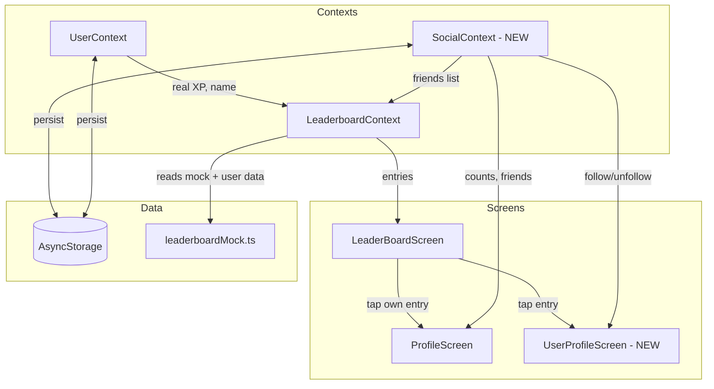

# Design Document: Social Leaderboard

## Overview

This feature addresses three areas of the Nimbus learning app:

1. **Leaderboard fixes** — The current mock data hardcodes the current user's name as `"You"` and generates random XP instead of reading from `UserContext`. The design replaces this with real XP sourcing and proper name display (`{Full Name} (You)`).

2. **Clickable leaderboard profiles** — Tapping a leaderboard entry navigates to a new `UserProfileScreen` (read-only view of another user) or to the existing `ProfileScreen` (if the entry is the current user). This requires a new stack screen and navigation params.

3. **Social system** — A new `SocialContext` manages followers/following/friends data in AsyncStorage. Friends are computed as mutual follows. The "friends" leaderboard period filters to friends only. `ProfileScreen` gains social counts and a friends list.

All data remains local via AsyncStorage. No backend is introduced.

## Architecture



### Key Architectural Decisions

1. **SocialContext as a separate context** — Social data (followers/following) is orthogonal to user profile data. Keeping it in its own context avoids bloating `UserContext` and allows independent loading/error handling.

2. **Friends computed, not stored** — Friends = intersection of followers and following lists. This avoids data duplication and ensures consistency. The computation is O(n) with a Set lookup.

3. **Leaderboard still uses mock data for other users** — Only the current user's entry is sourced from real `UserContext` XP. Other users remain mock-generated since there's no backend. The mock generator is updated to accept the current user's real data.

4. **UserProfileScreen as a stack screen** — Added to the root `Stack.Navigator` in `navigation/index.tsx` so it can be pushed from the leaderboard tab without disrupting tab navigation.

## Components and Interfaces

### New: SocialContext (`contexts/SocialContext.tsx`)

```typescript
interface SocialData {
  followers: string[];   // userIds who follow this user
  following: string[];   // userIds this user follows
}

interface SocialContextType {
  socialData: SocialData | null;
  friends: string[];                          // computed: intersection of followers & following
  loading: boolean;
  followUser: (targetUserId: string) => Promise<void>;
  unfollowUser: (targetUserId: string) => Promise<void>;
  isFollowing: (targetUserId: string) => boolean;
  getFollowersCount: (userId: string) => Promise<number>;
  getFollowingCount: (userId: string) => Promise<number>;
  loadSocialData: () => Promise<void>;
}
```

- `followUser` adds `targetUserId` to current user's `following`, adds current user's ID to target's `followers`, persists both, then updates state.
- `unfollowUser` is the inverse.
- `friends` is a derived value: `following.filter(id => followers.includes(id))` (using a Set for O(1) lookup).
- `isFollowing` checks if a userId is in the current user's following list.
- `getFollowersCount` / `getFollowingCount` read from AsyncStorage for any user (not just current).

### Updated: LeaderboardContext (`contexts/LeaderboardContext.tsx`)

Changes:
- `refreshLeaderboard` reads `user.xp` from `UserContext` and passes it to the mock generator so the current user's entry uses real XP.
- The mock generator sets the current user's `name` to `user.name` (not `"You"`).
- When `currentPeriod === "friends"`, entries are filtered to only include userIds in the `friends` list from `SocialContext`.
- Ranking logic: sort by `score` descending, assign `rank` starting at 1. If current user's score is lower than all other entries, exclude them.

### New: UserProfileScreen (`screens/UserProfileScreen.tsx`)

Props via route params:
```typescript
type UserProfileParams = {
  userId: string;
  name: string;
  avatarUrl?: string;
  level: number;
  xp: number;
  streakDays: number;
  badgesCount: number;
};
```

Displays: avatar, name, level, XP, streak, badges count, followers count, following count, and a follow/unfollow button. The follow/unfollow button calls `SocialContext.followUser` or `SocialContext.unfollowUser`. A back button returns to the previous screen.

### Updated: LeaderBoardScreen (`screens/LeaderBoardScreen.tsx`)

Changes:
- Each entry row is wrapped in `TouchableOpacity`.
- On press: if `entry.userId === user.userId`, navigate to `Profile` tab. Otherwise, navigate to `UserProfileScreen` with the entry's data as params.
- The current user's entry displays `{user.name} (You)` (already partially done, but the name source changes from mock to real).

### Updated: ProfileScreen (`screens/ProfileScreen.tsx`)

Changes:
- New stats row items: Followers count, Following count.
- New "Friends" section below boosters showing mutual follows with name and avatar.
- Data sourced from `SocialContext`.

### Updated: Navigation (`navigation/index.tsx`)

Changes:
- Add `UserProfileScreen` as a stack screen in the root navigator.

## Data Models

### AsyncStorage Key Design

| Key Pattern | Value | Description |
|---|---|---|
| `@nimbus_social_{userId}` | `JSON: SocialData` | Stores followers and following arrays for a given user |
| `@nimbus_user` | `JSON: User` | Existing — user profile (unchanged) |
| `@nimbus_users` | `JSON: StoredUser[]` | Existing — all registered users (unchanged) |

### SocialData Schema

```typescript
// Stored at @nimbus_social_{userId}
interface SocialData {
  followers: string[];   // array of userIds
  following: string[];   // array of userIds
}
```

### LeaderboardEntry (updated)

The existing `LeaderboardEntry` type remains unchanged. The change is behavioral: the mock generator now receives the current user's real `name` and `xp` from `UserContext` instead of hardcoding `"You"` and random XP.

### Navigation Types

```typescript
// Added to the root stack param list
type RootStackParamList = {
  // ... existing screens
  UserProfile: UserProfileParams;
};

type UserProfileParams = {
  userId: string;
  name: string;
  avatarUrl?: string;
  level: number;
  xp: number;
  streakDays: number;
  badgesCount: number;
};
```


## Correctness Properties

*A property is a characteristic or behavior that should hold true across all valid executions of a system — essentially, a formal statement about what the system should do. Properties serve as the bridge between human-readable specifications and machine-verifiable correctness guarantees.*

### Property 1: Current user entry reflects real user data

*For any* user with name `N` and XP value `X` in UserContext, the leaderboard entry generated for that user should have `name === N` and `xpEarned === X`.

**Validates: Requirements 1.1, 2.1**

### Property 2: Score calculation formula

*For any* non-negative integers `xpEarned` and `adventureBonus`, the computed score should equal `xpEarned + (adventureBonus * 2)`.

**Validates: Requirements 1.2**

### Property 3: Ranking produces correct descending order

*For any* list of leaderboard entries with distinct scores, after ranking, the entries should be sorted in descending order by score, and ranks should be sequential integers from 1 to N where N is the number of entries.

**Validates: Requirements 1.3, 1.4, 1.5**

### Property 4: Name display formatting

*For any* leaderboard entry and a current user ID, if the entry's userId matches the current user ID then the displayed name should be `"{name} (You)"`, otherwise the displayed name should be exactly `"{name}"` with no suffix.

**Validates: Requirements 2.2, 2.3**

### Property 5: Social data persistence round trip

*For any* valid SocialData object (with followers and following arrays of user ID strings), serializing it to AsyncStorage and then loading it back should produce an equivalent object.

**Validates: Requirements 4.1, 6.1**

### Property 6: Follow adds to both lists

*For any* pair of user IDs (currentUser, targetUser) where currentUser is not already following targetUser, calling `followUser(targetUser)` should result in targetUser appearing in currentUser's following list AND currentUser appearing in targetUser's followers list.

**Validates: Requirements 4.2**

### Property 7: Unfollow removes from both lists

*For any* pair of user IDs (currentUser, targetUser) where currentUser is currently following targetUser, calling `unfollowUser(targetUser)` should result in targetUser NOT appearing in currentUser's following list AND currentUser NOT appearing in targetUser's followers list.

**Validates: Requirements 4.3**

### Property 8: Friends equals intersection of followers and following

*For any* followers list and following list, the computed friends list should be exactly the set intersection — a userId appears in friends if and only if it appears in both followers and following.

**Validates: Requirements 5.1, 5.2, 5.4**

### Property 9: Friends period filters to friends only

*For any* set of leaderboard entries and any friends list, when the period is "friends", every entry in the filtered result should have a userId that is in the friends list, and no friend with an entry should be excluded.

**Validates: Requirements 5.5**

## Error Handling

| Scenario | Handling |
|---|---|
| AsyncStorage read fails for social data | `SocialContext` catches the error, logs it, and initializes empty `SocialData` (`{ followers: [], following: [] }`). The UI renders with zero counts. |
| AsyncStorage write fails on follow/unfollow | The operation catches the error, logs it, and does NOT update in-memory state (keeping UI consistent with persisted state). A console warning is emitted. |
| `UserContext` has no user when leaderboard loads | `LeaderboardContext.refreshLeaderboard` returns early (existing behavior). No current user entry is generated. |
| Navigation to `UserProfileScreen` with missing params | The screen checks for required params and shows a fallback "User not found" message with a back button. |
| Follow/unfollow called with the current user's own ID | `followUser` and `unfollowUser` silently ignore self-referential operations (a user cannot follow themselves). |
| Social data in AsyncStorage is corrupted/invalid JSON | `SocialContext` catches the parse error and initializes empty `SocialData`, effectively resetting the user's social data. |

## Testing Strategy

### Property-Based Testing

Use `fast-check` as the property-based testing library for TypeScript/React Native.

Each property test must:
- Run a minimum of 100 iterations
- Reference its design property with a tag comment: `// Feature: social-leaderboard, Property {N}: {title}`
- Be implemented as a single property-based test per correctness property

Property tests to implement:

1. **Property 1** — Generate random user names and XP values, pass them to the mock entry generator, assert the entry's `name` and `xpEarned` match.
2. **Property 2** — Generate random non-negative integer pairs `(xpEarned, adventureBonus)`, compute score, assert `score === xpEarned + adventureBonus * 2`.
3. **Property 3** — Generate random arrays of leaderboard entries with random scores, run the ranking function, assert descending order and sequential ranks 1..N.
4. **Property 4** — Generate random entry names and a random current user ID, apply the display formatting function, assert correct suffix behavior.
5. **Property 5** — Generate random `SocialData` objects, serialize to a mock AsyncStorage, deserialize, assert deep equality.
6. **Property 6** — Generate random user ID pairs, execute follow, assert both lists updated correctly.
7. **Property 7** — Generate random user ID pairs with an existing follow, execute unfollow, assert both lists updated correctly.
8. **Property 8** — Generate random followers and following arrays, compute friends, assert result equals set intersection.
9. **Property 9** — Generate random entries and a random friends list, filter by "friends" period, assert all results are in friends and no friends are missing.

### Unit Testing

Unit tests complement property tests for specific examples and edge cases:

- **Edge case**: Current user's score is lower than all others → excluded from leaderboard (Req 1.4)
- **Edge case**: Empty social data on first load → initialized to empty arrays (Req 6.3)
- **Edge case**: Self-follow attempt → silently ignored
- **Edge case**: Unfollow a user not currently followed → no-op, no error
- **Edge case**: Corrupted AsyncStorage JSON → graceful fallback to empty data
- **Example**: Storage key format follows `@nimbus_social_{userId}` pattern (Req 6.1)
- **Example**: Following then unfollowing returns to original state (round-trip)
- **Integration**: `LeaderboardContext` reads real XP from `UserContext` (not mock) for current user entry
